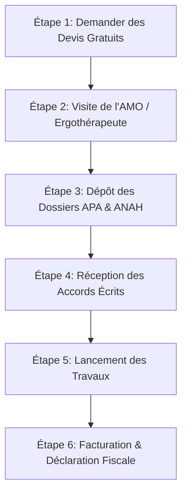

Adapter son logement pour prévenir le risque de chute est une étape clé pour préserver le maintien à domicile des personnes âgées. Dans le Vaucluse (84), les ménages seniors peuvent bénéficier de plusieurs subventions cumulables issues de l’État, du Conseil Départemental et d’organismes de protection sociale pour financer jusqu'à 80% du [coût d’achat et de pose d'un monte-escalier](/tarifs/).

Ce guide présente les dispositifs d'aides financières mobilisables en 2026 pour votre projet d'accessibilité dans le Vaucluse.

---

## 1. MaPrimeAdapt' (Le dispositif national de l'Anah)

Lancée par l'Agence Nationale de l'Habitat, **MaPrimeAdapt'** est l'aide de référence qui centralise les anciens financements d'adaptation du logement. Elle s'adresse aux retraités de 70 ans et plus, ou de 60 à 69 ans sous condition de perte d'autonomie (GIR 1 à 6).

L'aide est calculée en fonction du niveau de ressources du foyer, selon des plafonds nationaux de revenus (catégories Modestes ou Très Modestes) :

* **Ménages Très Modestes** : Subvention de **70% du montant HT** des travaux.
* **Ménages Modestes** : Subvention de **50% du montant HT** des travaux.
* **Plafond éligible** : Le montant maximal des travaux subventionnables est de **22 000 € HT**. L'aide maximale s'élève donc à 15 400 € pour la catégorie la plus modeste.

### L'importance de l'AMO (Assistance à Maîtrise d'Ouvrage)
Pour valider MaPrimeAdapt', la loi impose de faire appel à un **Accompagnateur Rénov'** agréé. Ce conseiller indépendant réalise un diagnostic ergonomique complet à votre domicile, valide le devis technique de l'installateur de monte-escalier et vous accompagne dans le montage du dossier administratif. Ses honoraires sont pris en charge jusqu'à 100% par l'Anah.

---

## 2. L'APA (Allocation Personnalisée d'Autonomie) dans le Vaucluse (84)

L'APA is une aide départementale majeure gérée par le **Conseil Départemental de Vaucluse**. Elle est destinée aux seniors de 60 ans et plus en situation de perte d'autonomie physique ou cognitive.

### Les critères d'obtention de l'APA 84
- Être classé dans les groupes **GIR 1, GIR 2, GIR 3 ou GIR 4** de la grille nationale AGGIR.
- Résider de façon stable dans le département de Vaucluse (résidence principale).
- Faire l'objet d'une visite d'évaluation par un travailleur social du département pour valider le plan d'aide personnalisé (incluant la préconisation d'un monte-escalier).

Le montant alloué varie selon le degré de dépendance (GIR) et les ressources du bénéficiaire. Il permet de couvrir la part restant à charge après déduction des autres aides nationales.

### Où s'adresser dans le Vaucluse ?
Vous pouvez retirer les dossiers d'APA auprès :
- Du CCAS (Centre Communal d'Action Sociale) de votre commune d'habitation (ex: Avignon, Carpentras, Orange, Cavaillon, L'Isle-sur-la-Sorgue, Pertuis, Apt).
- De la **Maison Départementale de l'Autonomie (MDA) de Vaucluse** dont le siège principal est situé à Avignon, avec des relais territoriaux dans tout le département.

---

## 3. Le crédit d'impôt de 25% pour l'accessibilité

Ce dispositif fiscal de transition écologique et solidaire est une aide précieuse pour tous les propriétaires occupants ou locataires vauclusiens adaptant leur logement principal. Il s'agit d'un crédit d'impôt de **25% sur les dépenses d'équipements PMR** (fourniture et pose).

### Les plafonds du crédit d'impôt
Le crédit d'impôt s'applique sur un plafond pluriannuel de dépenses s'étendant sur une période de 5 années consécutives :
* **5 000 €** pour une personne célibataire, veuve ou divorcée (soit un remboursement maximal de 1 250 €).
* **10 000 €** pour un couple marié ou pacsé soumis à une imposition commune (soit un remboursement de 2 500 €).
* Une majoration de **120 €** est appliquée par personne à charge supplémentaire.
* Si le montant du crédit d'impôt dépasse vos impôts dus, ou si vous n'êtes pas imposable, l'administration fiscale vous verse la différence par virement bancaire.

*Note de déclaration : Les dépenses d'accessibilité doivent être reportées sur la déclaration de revenus annuelle à la case **7WJ** du formulaire 2042 RICI.*

---

## 4. La Prestation Compensatrice de Handicap (PCH) du Vaucluse

Si la perte de mobilité intervient avant l'âge de 60 ans en raison d'une maladie dégénérative, d'un accident ou d'un handicap de naissance, c'est la **MDPH de Vaucluse** (Maison Départementale des Personnes Handicapées) qui intervient via la **PCH**.

Le volet "Aménagement du logement" de la PCH peut prendre en charge l'acquisition d'un fauteuil monte-escalier ou d'une plateforme PMR à hauteur de :
- **80% à 100%** du montant des travaux dans la limite d'un plafond de **10 000 €** par période de 10 ans.

---

## 5. Les aides complémentaires (CARSAT, Mutuelles et CCAS)

* **Les caisses de retraite (CARSAT Sud-Est)** : Dans le cadre de leur programme "Bien vieillir chez soi", les caisses d'assurance retraite peuvent attribuer des subventions exceptionnelles pour l'adaptation du logement de leurs allocataires (GIR 5 et 6 non éligibles à l'APA).
* **Action Logement** : Ce dispositif propose parfois des prêts à taux préférentiel (jusqu'à 10 000 €) pour l'aménagement PMR pour les retraités du secteur privé.
* **Les CCAS locaux du Vaucluse** : Certaines mairies vauclusiennes proposent des enveloppes d'aides exceptionnelles pour leurs résidents les plus précaires.

---

## 6. La feuille de route pour obtenir vos subventions (Pas à Pas)

Pour vous assurer de recevoir vos subventions, respectez scrupuleusement l'ordre administratif des étapes :

1. **Ne signez aucun [devis](/devis/)** ni bon de commande avant d'avoir déposé vos demandes d'aides. Tout début de travaux ou versement d'acompte avant le dépôt du dossier Anah ou APA entraîne le rejet systématique de la demande de subvention.
2. Demandez à votre installateur agréé du Vaucluse de vous fournir une facture détaillée faisant apparaître séparément la part fourniture du matériel et la part main-d'œuvre, avec la mention de conformité à la norme NF EN 81-40.

---

## FAQ Aides Financières Vaucluse

### Q. Les subventions Anah et le crédit d'impôt de 25% sont-ils cumulables ?
Oui, tout à fait. Le crédit d'impôt de 25% s'applique sur la part de la facture restant à votre charge réelle après déduction de la subvention MaPrimeAdapt' reçue.

### Q. Un locataire peut-il demander ces aides dans le Vaucluse ?
Oui. Le locataire d'un logement privé peut demander MaPrimeAdapt' et le crédit d'impôt. Il doit au préalable obtenir l'accord écrit de son propriétaire pour effectuer les travaux d'adaptation. Le propriétaire a l'obligation légale d'accepter si les travaux ne modifient pas la structure porteuse de l'immeuble.

### Q. Combien de temps faut-il pour obtenir l'accord de MaPrimeAdapt' dans le Vaucluse ?
Le délai moyen d'instruction des dossiers par la délégation Anah de Vaucluse varie entre **4 et 8 semaines** à compter de la réception d'un dossier complet. Il est donc recommandé d'anticiper les démarches avant que la perte de mobilité ne devienne bloquante.
